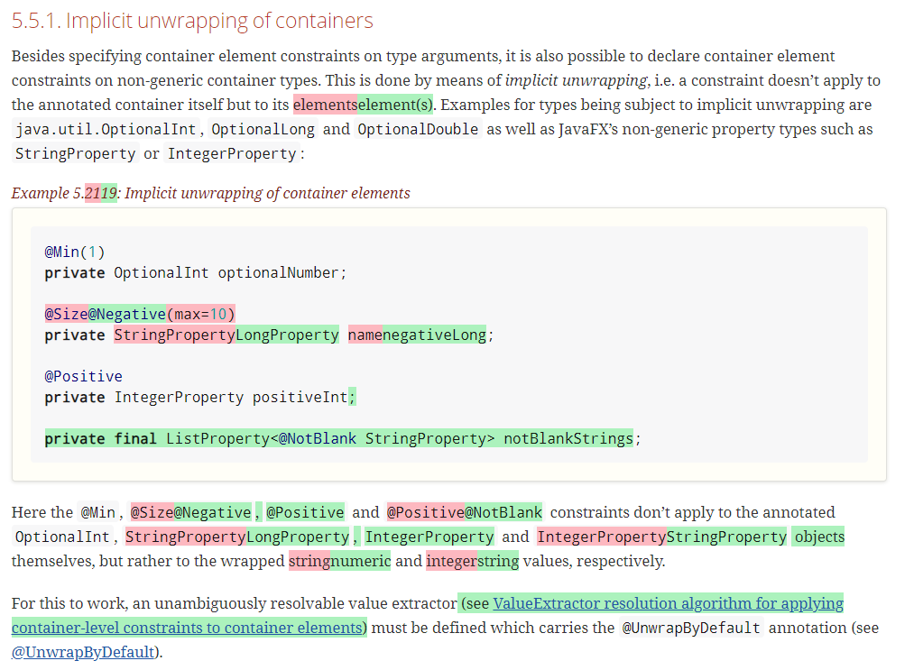

= Showing Differences in HTML AsciiDoc output

This uses two old versions of the Bean Validation specifictation to show some example HTML diff output.

== Prerequisites

You'll need https://nodejs.org/[node/npm] installed.
To view the result use a web browser like for example Chrome.

== How to run

----
npm install
npm run diff
----

This will create `bv2-diff.html` in your local folder.

== What to expect

You'll receive a HTML file with hightlighted changes similar to the following screenshot.

